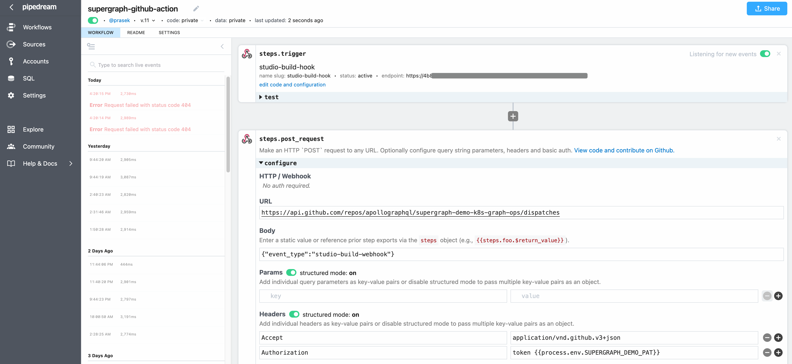

# Kubernetes-native GraphOps

This is the `GraphOps Repo` for the [apollographq/supergraph-demo](https://github.com/apollographql/supergraph-demo) `Source Repo`.


Contents:

* [Welcome](#welcome)
* [Overview](#overview)
* [Config Flow](#config-flow)
* [Docker Images from Source Repo](#docker-images-from-source-repo)
* [Supergraph Schemas from Graph Registry](#supergraph-schemas-from-graph-registry)
* [Deploy a Kubernetes Dev Environment](#deploy-a-kubernetes-dev-environment)
* [Promoting to Stage and Prod](#promoting-to-stage-and-prod)
* [GitOps](#gitops)
* [Progressive Delivery](#progressive-delivery)
* [Learn More](#learn-more)

## Welcome

Large-scale graph operators use Kubernetes to run their Graph Router and Subgraph Services, with continuous app and service delivery.

Kubernetes provides a mature control-plane for deploying and operating your graph using container images like those produced by the [supergraph-demo](https://github.com/apollographql/supergraph-demo) `Source Repo`.

## Overview

This repo follows the [Declarative GitOps CD for Kubernetes Best Practices](https://argoproj.github.io/argo-cd/user-guide/best_practices/):

`Source Repo` - provides image tag versions via `Bump image versions` PR

* [apollographql/supergraph-demo](https://github.com/apollographql/supergraph-demo) produces the artifacts:
  * Subgraph docker images w/ embedded subgraph schemas
  * Supergraph-router docker image that can be fed a composed supergraph schema via
    * (a) Apollo Uplink - for update in place
    * (b) via a `ConfigMap` for declarative k8s config management
* Continuous integration:
  * Bumps package version numbers & container tags.
  * Builds/publishes container images to container registry.
  * `Bump image versions` PRs to propagate image version bumps to this repo.
    * see end of the [example artifact release workflow](https://github.com/apollographql/supergraph-demo/blob/main/.github/workflows/release.yml)

`Graph Registry` - provides supergraph schema via `Bump supergraph schema` PR

* Graph schemas published to the Apollo Registry
  * Subgraphs publish their schema to the Apollo Registry after deployment.
  * Supergraph schema is published after Apollo Studio does:
    * Managed composition
    * Schema checks
    * Operation checks
    * No breaking changes are detected
  * Published supergraph schemas are made available via:
    * `Apollo Uplink` - that the Gateway can poll for live updates (default).
    * `Apollo Registry` - for retrieval via `rover supergraph fetch`.
    * `Apollo Build Webhook` - for triggering custom CD with the composed supergraph schema.
* `Bump supergraph schema` PRs are created by the [supergraph-build-webhook.yml workflow](https://github.com/apollographql/supergraph-demo-k8s-graphops/blob/main/.github/workflows/supergraph-build-webhook.yml) via:
  * Supergraph build webhook from Apollo Studio
  * Polling on a schedule in case a webhook is lost

`GraphOps Repo` (this repo) - declarative graph config for Kubernetes for GitOps

* Declarative k8s configs for `dev`, `stage`, and `prod`
  * [./clusters](https://github.com/apollographql/supergraph-demo-k8s-graph-ops/tree/main/clusters) - base cluster & GitOps config
  * [./infra](https://github.com/apollographql/supergraph-demo-k8s-graph-ops/tree/main/infra) - nginx, etc.
  * [./router](https://github.com/apollographql/supergraph-demo-k8s-graph-ops/tree/main/router) - supergraph router config
  * [./subgraphs](https://github.com/apollographql/supergraph-demo-k8s-graph-ops/tree/main/subgraphs) - products, inventory, users
* Promote config from `dev` -> `stage` -> `prod`
  * `make promote-dev-stage`
  * `make promote-stage-prod`
* Continuous deployment:
  * via GitOps operators like [Flux](https://fluxcd.io/) and [ArgoCD](https://argoproj.github.io/argo-cd/)
  * using progressive delivery controllers like [Argo Rollouts](https://argoproj.github.io/argo-rollouts/) and [Flagger](https://flagger.app/)
  * or your favorite tools!

`kustomize` for k8s-native config management:

* [https://kustomize.io/](https://kustomize.io/)
* [kustomize helm example](https://github.com/fluxcd/flux2-kustomize-helm-example)
* [multi-tenancy example](https://github.com/fluxcd/flux2-multi-tenancy)
* [best-practices discussion thread](https://github.com/fluxcd/flux/issues/1071)

## Config Flow

Config data flows from the following sources:

* `Source Repo`:
  * `Bump image versions` PR is opened on the `GraphOps Repo`:
    * when new Gateway docker image versions are published:
      * see end of the [example artifact release workflow](https://github.com/apollographql/supergraph-demo/blob/main/.github/workflows/release.yml)
      * bumps package versions in the `Source Repo`.
      * does an incremental monorepo build and pushes new docker images to DockerHub.
      * opens `GraphOps Repo` PR to bump the docker image versions in the `dev` environment (auto-merge).

* `Graph Registry`:
  * `Bump supergraph schema` PR is opened on the `GraphOps Repo`:
    * when Managed Federation sends a supergraph schema build webhook
      * `rover supergraph fetch` is used to retrieve the supergraph schema from the Apollo Registry.

* `GraphOps Repo`:
  * GraphOps team crafts the declarative configurations for each environment.
    * [./clusters](https://github.com/apollographql/supergraph-demo-k8s-graph-ops/tree/main/clusters) - base cluster & GitOps config
    * [./infra](https://github.com/apollographql/supergraph-demo-k8s-graph-ops/tree/main/infra) - nginx, etc.
    * [./router](https://github.com/apollographql/supergraph-demo-k8s-graph-ops/tree/main/router) - supergraph router config
    * [./subgraphs](https://github.com/apollographql/supergraph-demo-k8s-graph-ops/tree/main/subgraphs) - products, inventory, users
  * PRs for [docker image bumps](https://github.com/apollographql/supergraph-demo-k8s-graph-ops/pull/42) are (auto-)merged into the `GraphOps Repo`.
  * PR for [supergraph schema bumps](https://github.com/apollographql/supergraph-demo-k8s-graph-ops/pull/36) are (auto-)merged into the `GraphOps Repo`.
  * `GraphOps Repo` has definitive desired state for each environment.

Continous deployment of config data flows from the `GraphOps Repo` into the target k8s cluster:

* Via `kubectl apply -k` or GitOps tools like [ArgoCD](https://argoproj.github.io/argo-cd/user-guide/kustomize/) or [Flux](https://fluxcd.io/docs/components/kustomize/)

* `kustomize` is used to generate parameterized config resources for each environment:
  * for example: [./router/dev/kustomization.yaml](https://github.com/apollographql/supergraph-demo-k8s-graph-ops/blob/main/router/dev/kustomization.yaml)
    * `configMapGenerator` supergraph.graphl schema
    * `images` with tag version bumps
* Progressive delivery controllers like [Argo Rollouts](https://argoproj.github.io/argo-rollouts/) or [Flagger](https://flagger.app/) may also be used
  * `BlueGreen` and `Canary` deployment strategies
* `Rollback` via git commit & GitOps or progressive delivery controller [rollback](https://argoproj.github.io/argo-rollouts/FAQ.html#how-does-bluegreen-rollback-work).

## Docker Images from Source Repo

New Gateway docker image versions are published as source changes are pushed to the main branch of the [supergraph-demo](https://github.com/apollographql/supergraph-demo) repo.

This is done by the [release.yml workflow](https://github.com/apollographql/supergraph-demo/blob/main/.github/workflows/release.yml), which does an incremental matrix build and pushes new docker images to DockerHub, and then opens a `Bump image versions` PR in this repo that uses `kustomize edit set image` to inject the new image version tags into the [kustomization.yaml](https://github.com/apollographql/supergraph-demo-k8s-graphops/blob/main/router/dev/kustomization.yaml) for each environment.


**Note: This workflow can be easily adapted for a single-repo-per-package scenarios, where they separately publish their own docker images and issue separate version bump PRs to this `GraphOps Repo`.**

## Supergraph Schemas from Graph Registry

1. Detecting changes to the supergraph built via Managed Federation

   * Managed Federation builds a supergraph schema after each `rover subgraph publish`
   * Changes detected with the following:
     * [Supergraph build webhooks](https://www.apollographql.com/blog/announcement/webhooks/) - when a new supergraph schema is built in Apollo Studio
     * `rover supergraph fetch` - to poll the Registry

2. `Bump supergraph schema` PR with auto-merge enabled when changes detected
   * Workflow: [supergraph-build-webhook.yml](https://github.com/apollographql/supergraph-demo-k8s-graphops/blob/main/.github/workflows/supergraph-build-webhook.yml)
   * Commits a new supergraph.graphql to the `GraphOps Repo` with the new version from Apollo Studio
   * Additional CI checks on the supergraph schema are required for the PR to merge
   * Auto-merged when CI checks pass

3. Generate a new Gateway `Deployment` and `ConfigMap` using `kustomize`
   * Once changes to `supergraph.graphql` when `Bump supergraph schema` is merged

### Using the Supergraph Build Webhook

1. Register the webhook in Apollo Studio in your graph settings
   * Send the webhook to an automation service or serverless function:
   * 

2. Adapt the webhook to a GitHub `repository_dispatch` POST request
   * Create a webhook proxy that passes a `repo` scoped personal access token (PAT)
   * Using a [GitHub machine account](https://github.com/peter-evans/create-pull-request/blob/main/docs/concepts-guidelines.md#workarounds-to-trigger-further-workflow-runs) with limited access:
   * 

3. `repository_dispatch` event triggers a GitHub workflow
   * [supergraph-build-webhook.yml](https://github.com/apollographql/supergraph-demo-k8s-graphops/blob/main/.github/workflows/supergraph-build-webhook.yml)
   * uses both `repository_dispatch` and `scheduled` to catch any lost webhooks:
   * 

4. GitHub workflow automatically creates a PR with auto-merge enabled
   * [supergraph-build-webhook.yml](https://github.com/apollographql/supergraph-demo-k8s-graphops/blob/main/.github/workflows/supergraph-build-webhook.yml)
   * using a GitHub action like [Create Pull Request](https://github.com/marketplace/actions/create-pull-request) - see [concepts & guidelines](https://github.com/peter-evans/create-pull-request/blob/main/docs/concepts-guidelines.md)
   * 

## Deploy a Kubernetes Dev Environment

You'll need:

* [kubectl](https://kubernetes.io/docs/tasks/tools/) - with expanded `kustomize` support for `resources`
* [kind](https://kind.sigs.k8s.io/docs/user/quick-start/#installation)

then run:

```sh
make demo
```

which runs:
```sh
make k8s-up-dev
```

which creates:

* local k8s cluster with the NGINX Ingress Controller
* graph-router `Deployment` configured to use a supergraph `ConfigMap`
* graph-router `Service` and `Ingress`

and applies the following:

```
kubectl apply -k infra/dev
kubectl apply -k subgraphs/dev
kubectl apply -k router/dev
```

### Gateway Deployment with ConfigMap

using [router/base/router.yaml](router/base/router.yaml):

```yaml
apiVersion: apps/v1
kind: Deployment
metadata:
  labels:
    app: router
  name: router-deployment
spec:
  replicas: 1
  selector:
    matchLabels:
      app: router
  template:
    metadata:
      labels:
        app: router
    spec:
      containers:
      - env:
        - name: APOLLO_SCHEMA_CONFIG_EMBEDDED
          value: "true"
        image: prasek/supergraph-router:1.1.1
        name: router
        ports:
        - containerPort: 4000
        volumeMounts:
        - mountPath: /etc/config
          name: supergraph-volume
      volumes:
      - configMap:
          name: supergraph-c4mh62bddt
        name: supergraph-volume
---
apiVersion: v1
kind: ConfigMap
metadata:
  name: supergraph-c4mh62bddt
data:
  supergraph.graphql: |
    schema
      @core(feature: "https://specs.apollo.dev/core/v0.1"),
      @core(feature: "https://specs.apollo.dev/join/v0.1")
    {
      query: Query
    }

    directive @core(feature: String!) repeatable on SCHEMA

    directive @join__field(graph: join__Graph, requires: join__FieldSet, provides: join__FieldSet) on FIELD_DEFINITION

    directive @join__type(graph: join__Graph!, key: join__FieldSet) repeatable on OBJECT | INTERFACE

    directive @join__owner(graph: join__Graph!) on OBJECT | INTERFACE

    directive @join__graph(name: String!, url: String!) on ENUM_VALUE

    type DeliveryEstimates {
      estimatedDelivery: String
      fastestDelivery: String
    }

    scalar join__FieldSet

    enum join__Graph {
      INVENTORY @join__graph(name: "inventory" url: "http://inventory:4000/graphql")
      PRODUCTS @join__graph(name: "products" url: "http://products:4000/graphql")
      USERS @join__graph(name: "users" url: "https://users:4000/graphql")
    }

    type Product
      @join__owner(graph: PRODUCTS)
      @join__type(graph: PRODUCTS, key: "id")
      @join__type(graph: PRODUCTS, key: "sku package")
      @join__type(graph: PRODUCTS, key: "sku variation{id}")
      @join__type(graph: INVENTORY, key: "id")
    {
      id: ID! @join__field(graph: PRODUCTS)
      sku: String @join__field(graph: PRODUCTS)
      package: String @join__field(graph: PRODUCTS)
      variation: ProductVariation @join__field(graph: PRODUCTS)
      dimensions: ProductDimension @join__field(graph: PRODUCTS)
      createdBy: User @join__field(graph: PRODUCTS, provides: "totalProductsCreated")
      delivery(zip: String): DeliveryEstimates @join__field(graph: INVENTORY, requires: "dimensions{size weight}")
    }

    type ProductDimension {
      size: String
      weight: Float
    }

    type ProductVariation {
      id: ID!
    }

    type Query {
      allProducts: [Product] @join__field(graph: PRODUCTS)
      product(id: ID!): Product @join__field(graph: PRODUCTS)
    }

    type User
      @join__owner(graph: USERS)
      @join__type(graph: USERS, key: "email")
      @join__type(graph: PRODUCTS, key: "email")
    {
      email: ID! @join__field(graph: USERS)
      name: String @join__field(graph: USERS)
      totalProductsCreated: Int @join__field(graph: USERS)
    }
---
apiVersion: v1
kind: Service
metadata:
  name: router-service
spec:
  ports:
  - port: 4000
    protocol: TCP
    targetPort: 4000
  selector:
    app: router
---
apiVersion: networking.k8s.io/v1
kind: Ingress
metadata:
  annotations:
    kubernetes.io/ingress.class: nginx
  name: router-ingress
spec:
  rules:
  - http:
      paths:
      - backend:
          service:
            name: router-service
            port:
              number: 4000
        path: /
        pathType: Prefix
```

and 3 subgraph services [subgraphs/base/subgraphs.yaml](subgraphs/base/subgraphs.yaml):

`make demo` then runs the following in a loop until the query succeeds or 2 min timeout:

### Make a GraphQL Query

```sh
kubectl get all
make k8s-query
```

which shows the following:

```
NAME                                     READY   STATUS    RESTARTS   AGE
pod/inventory-65494cbf8f-bhtft           1/1     Running   0          59s
pod/products-6d75ff449c-9sdnd            1/1     Running   0          59s
pod/router-deployment-84cbc9f689-8fcnf   1/1     Running   0          20s
pod/users-d85ccf5d9-cgn4k                1/1     Running   0          59s

NAME                     TYPE        CLUSTER-IP      EXTERNAL-IP   PORT(S)    AGE
service/inventory        ClusterIP   10.96.108.120   <none>        4000/TCP   59s
service/kubernetes       ClusterIP   10.96.0.1       <none>        443/TCP    96s
service/products         ClusterIP   10.96.65.206    <none>        4000/TCP   59s
service/router-service   ClusterIP   10.96.178.206   <none>        4000/TCP   20s
service/users            ClusterIP   10.96.98.53     <none>        4000/TCP   59s

NAME                                READY   UP-TO-DATE   AVAILABLE   AGE
deployment.apps/inventory           1/1     1            1           59s
deployment.apps/products            1/1     1            1           59s
deployment.apps/router-deployment   1/1     1            1           20s
deployment.apps/users               1/1     1            1           59s

NAME                                           DESIRED   CURRENT   READY   AGE
replicaset.apps/inventory-65494cbf8f           1         1         1       59s
replicaset.apps/products-6d75ff449c            1         1         1       59s
replicaset.apps/router-deployment-84cbc9f689   1         1         1       20s
replicaset.apps/users-d85ccf5d9                1         1         1       59s
Smoke test
-------------------------------------------------------------------------------------------
++ curl -X POST -H 'Content-Type: application/json' --data '{ "query": "{ allProducts { id, sku, createdBy { email, totalProductsCreated } } }" }' http://localhost:80/
  % Total    % Received % Xferd  Average Speed   Time    Time     Time  Current
                                 Dload  Upload   Total   Spent    Left  Speed
100   352  100   267  100    85   3000    955 --:--:-- --:--:-- --:--:--  3911
{"data":{"allProducts":[{"id":"apollo-federation","sku":"federation","createdBy":{"email":"support@apollographql.com","totalProductsCreated":1337}},{"id":"apollo-studio","sku":"studio","createdBy":{"email":"support@apollographql.com","totalProductsCreated":1337}}]}}
Success!
-------------------------------------------------------------------------------------------
```

### Cleanup

`make demo` then cleans up:

```
deployment.apps "graph-router" deleted
service "graphql-service" deleted
ingress.networking.k8s.io "graphql-ingress" deleted
Deleting cluster "kind" ...
```

## Promoting to Stage and Prod

Promoting configs from from dev -> stage -> prod can be as simple as:

1. copying the config from one environment to the next
   * `make promote-dev-stage`
   * `make promote-stage-prod`
1. push the changes

The GitOps operator in each Kubernetes cluster will pull the environment configuration from this `GraphOps Repo` and any changes will be applied to that cluster.

## GitOps

CD via GitOps:

* via GitOps operators like [Flux](https://fluxcd.io/) and [ArgoCD](https://argoproj.github.io/argo-cd/)

We'll use `flux` v2 for this example, so you'll need:

* [flux](https://fluxcd.io/docs/cmd/)

then run:

```sh
make demo-flux
```

which runs:

```sh
make k8s-up-flux-dev
```

which shows something like:

```
.scripts/k8s-up-flux.sh dev
Using dev/kustomization.yaml
kind version 0.11.1
No kind clusters found.
Creating cluster "kind" ...
 ✓ Ensuring node image (kindest/node:v1.21.1) 🖼
 ✓ Preparing nodes 📦
 ✓ Writing configuration 📜
 ✓ Starting control-plane 🕹️
 ✓ Installing CNI 🔌
 ✓ Installing StorageClass 💾
 ✓ Waiting ≤ 5m0s for control-plane = Ready ⏳
 • Ready after 28s 💚
Set kubectl context to "kind-kind"
You can now use your cluster with:

kubectl cluster-info --context kind-kind

Not sure what to do next? 😅  Check out https://kind.sigs.k8s.io/docs/user/quick-start/
✚ generating manifests
✔ manifests build completed
► installing components in flux-system namespace
◎ verifying installation
✔ source-controller: deployment ready
✔ kustomize-controller: deployment ready
✔ helm-controller: deployment ready
✔ notification-controller: deployment ready
✔ install finished
✚ generating GitRepository source
► applying GitRepository source
✔ GitRepository source created
◎ waiting for GitRepository source reconciliation
✔ GitRepository source reconciliation completed
✔ fetched revision: main/43c1c8990b7bdecde49eec2360f839813b769e81
✚ generating Kustomization
► applying Kustomization
✔ Kustomization created
◎ waiting for Kustomization reconciliation
✔ Kustomization infra is ready
✔ applied revision main/43c1c8990b7bdecde49eec2360f839813b769e81
✚ generating Kustomization
► applying Kustomization
✔ Kustomization created
◎ waiting for Kustomization reconciliation
✔ Kustomization subgraphs is ready
✔ applied revision main/43c1c8990b7bdecde49eec2360f839813b769e81
✚ generating Kustomization
► applying Kustomization
✔ Kustomization created
◎ waiting for Kustomization reconciliation
```

the router ingress config needs the nginx ingress controller, so you'll see this while the nginx ingress admission controller is starting, but with GitOps and `flux` the configuration will be re-applied so will self-heal once it's started:

```
✗ apply failed: Error from server (InternalError): error when creating "d19c481c-1209-4177-b62f-b1ab83c027ac.yaml": Internal error occurred: failed calling webhook "validate.nginx.ingress.kubernetes.io": Post "https://ingress-nginx-controller-admission.ingress-nginx.svc:443/networking/v1beta1/ingresses?timeout=10s": context deadline exceeded
```

then smoke tests will run while the nginx ingress admission controller is starting, with the initial tests failing while the nginx admission controller is starting:

```
-------------------------
Test 1
-------------------------
++ curl -X POST -H 'Content-Type: application/json' --data '{ "query": "{allProducts{delivery{estimatedDelivery,fastestDelivery},createdBy{name,email}}}" }' http://localhost:80/
  % Total    % Received % Xferd  Average Speed   Time    Time     Time  Current
                                 Dload  Upload   Total   Spent    Left  Speed
100   241  100   146  100    95  29200  19000 --:--:-- --:--:-- --:--:-- 48200
-------------------------
❌ Test 1
-------------------------
[Expected]
{"data":{"allProducts":[{"delivery":{"estimatedDelivery":"6/25/2021","fastestDelivery":"6/24/2021"},"createdBy":{"name":"Apollo Studio Support","email":"support@apollographql.com"}},{"delivery":{"estimatedDelivery":"6/25/2021","fastestDelivery":"6/24/2021"},"createdBy":{"name":"Apollo Studio Support","email":"support@apollographql.com"}}]}}
-------------------------
[Actual]
<html>
<head><title>404 Not Found</title></head>
<body>
<center><h1>404 Not Found</h1></center>
<hr><center>nginx</center>
</body>
</html>
-------------------------
❌ Test 1
-------------------------
```

and then once it's started and the router ingress can be applied, the smoke tests will pass:

```
-------------------------
Test 1
-------------------------
++ curl -X POST -H 'Content-Type: application/json' --data '{ "query": "{allProducts{delivery{estimatedDelivery,fastestDelivery},createdBy{name,email}}}" }' http://localhost:80/
  % Total    % Received % Xferd  Average Speed   Time    Time     Time  Current
                                 Dload  Upload   Total   Spent    Left  Speed
100   438  100   343  100    95   1982    549 --:--:-- --:--:-- --:--:--  2531

Result:
{"data":{"allProducts":[{"delivery":{"estimatedDelivery":"6/25/2021","fastestDelivery":"6/24/2021"},"createdBy":{"name":"Apollo Studio Support","email":"support@apollographql.com"}},{"delivery":{"estimatedDelivery":"6/25/2021","fastestDelivery":"6/24/2021"},"createdBy":{"name":"Apollo Studio Support","email":"support@apollographql.com"}}]}}

✅ Test 1

-------------------------
Test 2
-------------------------
++ curl -X POST -H 'Content-Type: application/json' --data '{ "query": "{allProducts{id,sku,createdBy{email,totalProductsCreated}}}" }' http://localhost:80/
  % Total    % Received % Xferd  Average Speed   Time    Time     Time  Current
                                 Dload  Upload   Total   Spent    Left  Speed
100   341  100   267  100    74  17800   4933 --:--:-- --:--:-- --:--:-- 22733

Result:
{"data":{"allProducts":[{"id":"apollo-federation","sku":"federation","createdBy":{"email":"support@apollographql.com","totalProductsCreated":1337}},{"id":"apollo-studio","sku":"studio","createdBy":{"email":"support@apollographql.com","totalProductsCreated":1337}}]}}

✅ Test 2

✅ All tests pass! 🚀
```

then finally the kind cluster will be deleted:

```
.scripts/k8s-down.sh
Deleting cluster "kind" ...
```

## Progressive Delivery

* using progressive delivery controllers like [Argo Rollouts](https://argoproj.github.io/argo-rollouts/) and [Flagger](https://flagger.app/)
* or your favorite tools!

Example coming soon!

## Learn More

Checkout the [apollographq/supergraph-demo](https://github.com/apollographql/supergraph-demo) `Source Repo`.

Learn more about [how Apollo can help your teams ship faster](https://www.apollographql.com/docs/studio/).
